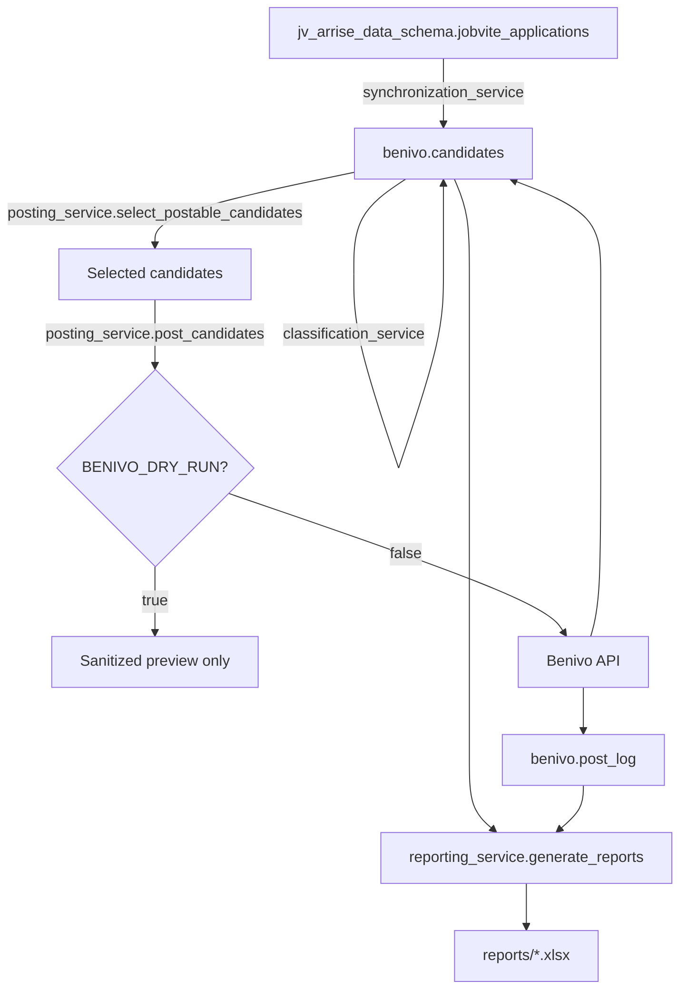

# Benivo Automation

Automates creating relocation candidates in [Benivo](https://www.benivo.com/)
from candidate data synced out of Jobvite, so recruiters don't have to
manually re-enter relocating hires into Benivo one at a time.

Day-2 operations (checking logs, retrying a failed candidate, rolling back a
deploy) live in [`docs/OPERATIONS.md`](docs/OPERATIONS.md). This file covers
what the system does and how to set it up.

## Business purpose

A candidate who accepts a role that requires relocation needs a Benivo
profile so Benivo's relocation-vendor network can support their move. Today
that Benivo profile is created by hand. This automation:

1. keeps a working table of relocation candidates in sync with the source
   Jobvite data already replicated into Postgres,
2. classifies each candidate into an operational state (ready to post,
   missing information, needs recruiter attention, etc.),
3. posts eligible candidates to Benivo's UAT/production API,
4. keeps a permanent audit trail of every attempt,
5. produces an Excel report every run so recruiters/ops can see exactly
   where every candidate stands and why.

## Architecture

```
jv_arrise_data_schema.jobvite_applications (Postgres, source of truth)
        |
        v
sync_candidates ---------------------------> benivo.candidates
        |                                    (operational table)
        v
classify_candidates
        |
        v
select_postable_candidates  (LIMIT BENIVO_MAX_CANDIDATES, oldest first)
        |
        v
post_candidates  --(if not dry run)--> Benivo API --> benivo.post_log
        |                                              (audit trail, never overwritten)
        v
generate_reports --> reports/benivo_operational_report_<timestamp>.xlsx
```



### Module layout

```
app/
  config.py              centralized env var parsing + startup validation
  logging_config.py       one place that configures logging
  main.py                 CLI entry point: sync | classify | report | post | run
  clients/
    database_client.py    raw Postgres connection/transaction primitives
    benivo_client.py       raw Benivo API calls (auth, refdata, lookup, create)
  repositories/
    candidate_repository.py   benivo.candidates reads/writes
    post_log_repository.py    benivo.post_log reads/writes
  services/
    synchronization_service.py   sync_candidates() -- pure data sync, no business rules
    classification_service.py    classify_candidates() -- the only place business rules live
    office_resolution_service.py Jobvite workplace -> Benivo officeId
    policy_service.py            is_vip -> policy_name -> policy_api_value
    posting_service.py           candidate selection, Benivo posting, post_log writes
    reporting_service.py         Excel report generation
  models/domain.py         shared status-string constants (single source of truth)
  utils/helpers.py          small generic helpers (env parsing, email masking)
migrations/                 forward-only SQL migrations (0001-0004 so far)
scripts/                    thin CLI wrappers + the migration runner
legacy/                     superseded code, kept for reference, not wired in
tests/                      mirrors the app/ module layout
```

Each service has one responsibility; `posting_service` is the only place
that decides whether to actually call Benivo (`BENIVO_DRY_RUN`) or restrict
itself to a single explicitly-approved candidate (`BENIVO_UAT_APPLICATION_EID`).

## Candidate eligibility rules

A candidate is synced into `benivo.candidates` when, in the source table:

- `workflow_state = 'Mobility in process'`
- the `is_relocation_required` Jobvite custom field is `Yes` or `No`

Once synced, `classification_service.classify()` decides the operational
status from three inputs only -- `is_relocation_required`, `start_date`,
`workplace` -- re-evaluated on every run:

| relocation | start_date | workplace mapped to a Benivo office? | status |
|---|---|---|---|
| Yes | present | yes | `READY_TO_POST` |
| Yes | present | no | `PENDING_OFFICE_MAPPING` |
| Yes | missing | -- | `PENDING_MISSING_START_DATE` |
| No / blank / unrecognized | -- | -- | `NEEDS_RECRUITER_REVIEW` |

## Operational statuses

| Status | Meaning | Terminal? |
|---|---|---|
| `PENDING` | Just synced, not yet classified (transient) | no |
| `READY_TO_POST` | Eligible, will be selected for posting | no |
| `PENDING_MISSING_START_DATE` | Relocation required, no start date yet | no |
| `PENDING_OFFICE_MAPPING` | Relocation required, workplace has no confirmed Benivo office mapping yet | no |
| `NEEDS_RECRUITER_REVIEW` | Relocation is `No`/blank/unrecognized -- recruiters sometimes get this field wrong, so these candidates stay visible and are re-classified every run | no |
| `POST_FAILED` | Last Benivo attempt failed | no -- freely retried |
| `POSTED` | Confirmed `SUCCESS` or `ALREADY_EXISTS` in `benivo.post_log` | **yes, the only terminal status** |

A candidate that falls out of the source query entirely (workflow moved on,
relocation field changed) is removed from `benivo.candidates` -- history
isn't lost, it still lives in the source table and in `benivo.post_log`.

## Policy mapping: Basic -> "Tier 1"

Benivo's API does not accept the business labels `"Basic"`/`"VIP"` directly
-- confirmed the hard way: the first real UAT attempt sent `policy="Basic"`
and Benivo rejected it (`"Policy is misspelled"`). The real values come from
Benivo's own `refdata.policies` endpoint (`"Tier 1"`, `"Tier 2"`, `"Tier 3"`,
`"Game Presenters and Shufflers"`).

`policy_service` therefore separates three concepts:

- **`is_vip`** (boolean, stored on the candidate) -- the only input.
- **`policy_name`** (`"Basic"` or `"VIP"`) -- the business label. Never
  overwritten by the API-specific value.
- **`policy_api_value`** -- the exact string sent to Benivo. Confirmed:
  `Basic -> "Tier 1"` (validated live in UAT, `pCu0IxwQ` -> `SUCCESS`,
  `benivo_user_id=605070`).

### VIP is blocked, on purpose

No confirmed Benivo API value exists for VIP anywhere -- not in refdata,
not in any historical payload. `policy_api_value` for VIP is `None`, which
fails payload validation, which blocks the create-user call before it ever
happens. This is deliberate: a guessed value could create a VIP candidate
under the wrong policy tier. Do not add a VIP mapping without confirming
the real value first (e.g. against Benivo refdata or support).

## Setup

```bash
git clone <repo>
cd Benivo
python -m venv venv
source venv/bin/activate   # or venv\Scripts\activate on Windows
pip install -r requirements.txt
cp .env.example .env
# edit .env with real DB and Benivo credentials
```

The app validates required settings at startup and exits with a clear error
if anything's missing -- see `.env.example` for the full list.

## Migrations

```bash
python scripts/migrate.py --check   # lists applied/pending, changes nothing
python scripts/migrate.py --apply   # applies pending migrations, in order
```

Tracked in `benivo._schema_migrations` (created automatically). Every
migration file uses `IF NOT EXISTS`/`DROP ... IF EXISTS`, so re-running an
already-applied file is a safe no-op. Never edit an applied migration file --
add a new one instead.

## Running locally

```bash
python -m app.main sync       # refresh benivo.candidates from the source table
python -m app.main classify   # re-derive benivo_status for every candidate
python -m app.main report     # generate the Excel report; NEVER posts, regardless of BENIVO_DRY_RUN
python -m app.main post       # select + post eligible candidates, respecting BENIVO_DRY_RUN
python -m app.main run        # the full sequence: sync -> classify -> post -> report
```

Equivalent convenience scripts exist under `scripts/` (`run_sync.py`,
`run_posting.py`, `run_report.py`) for anyone who'd rather not remember the
`-m` invocation, plus `scripts/validate_uat_candidate.py <application_eid>`
for a read-only pre-flight check on one candidate.

## Dry run (default, safe)

`BENIVO_DRY_RUN=true` (the default) means `post`/`run` build and log
sanitized payload previews but make **no** create-user or user-lookup call.
Set `BENIVO_ALLOW_REFERENCE_DATA_CALLS=true` alongside it to additionally
authenticate and fetch live refdata (read-only) so office resolution shows
real results in the preview:

```bash
BENIVO_DRY_RUN=true BENIVO_MAX_CANDIDATES=5 BENIVO_ALLOW_REFERENCE_DATA_CALLS=true \
  python -m app.main run
```

## Real posting

Requires `BENIVO_DRY_RUN=false`. For anything beyond a routine scheduled
batch, use `BENIVO_UAT_APPLICATION_EID` to pin the run to one explicitly
confirmed candidate -- selection re-validates every eligibility condition
individually and refuses to fall back to a different candidate if it fails:

```bash
BENIVO_DRY_RUN=false BENIVO_MAX_CANDIDATES=1 BENIVO_ALLOW_REFERENCE_DATA_CALLS=true \
  BENIVO_UAT_APPLICATION_EID=<confirmed application_eid> \
  python -m app.main post
```

## Scheduled execution (Ubuntu VM)

See [`docs/OPERATIONS.md`](docs/OPERATIONS.md) for the cron/systemd setup,
this is the one-liner it runs:

```bash
python -m app.main run
```

## Reports

Every `report`/`post`/`run` invocation writes
`reports/benivo_operational_report_<UTC timestamp>.xlsx` (path configurable
via `REPORT_FOLDER`) with a `Summary` sheet plus one worksheet per
classification (`Ready to Post`, `Missing Start Date`,
`Relocation Field Review`, `Missing Office Mapping`, `Posting Results`).
Every candidate-level row includes `workflow_state`, `is_relocation_required`,
`benivo_status`, `policy_name`, and a plain-language `reason`.

## Retry behavior

`POST_FAILED` is not terminal. `classification_service` re-evaluates every
non-`POSTED` candidate on every run, so a candidate that failed (e.g. an
unresolved office at the time) automatically becomes eligible again the
moment the underlying issue is fixed -- no manual retry step needed.

## Duplicate prevention

`benivo.post_log` has a partial unique index on `application_eid` where
`status IN ('SUCCESS', 'ALREADY_EXISTS')` -- the database itself refuses a
second terminal row for the same candidate. Candidate selection
additionally excludes any `application_eid` with an existing terminal
`post_log` row before ever attempting a call.

## Troubleshooting

See [`docs/OPERATIONS.md`](docs/OPERATIONS.md).

## Safe deployment and rollback

See [`docs/OPERATIONS.md`](docs/OPERATIONS.md).
